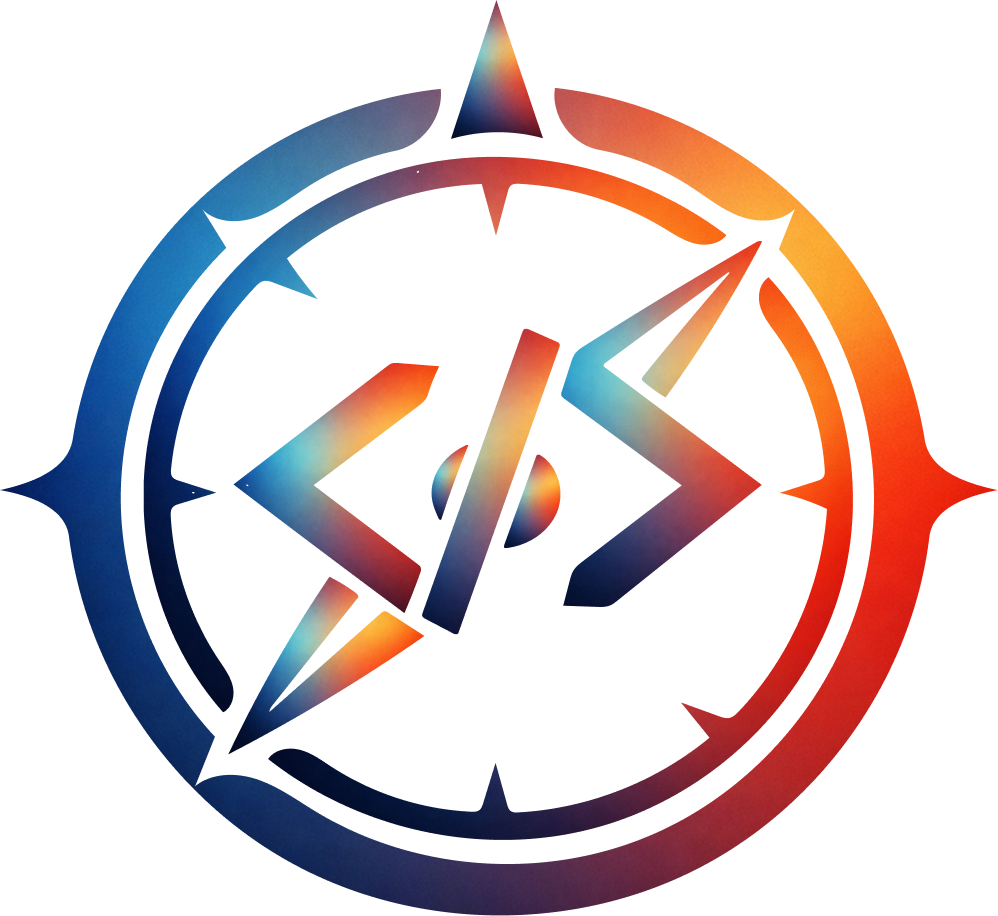
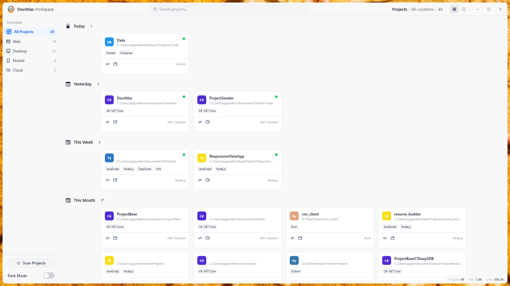

<div align="center">

<br />



<br />

**Comprehensive Project Discovery and Management Tool for Developers**

[](https://dotnet.microsoft.com/download/dotnet/10.0)
[](https://github.com/kodzamani/DevAtlas)
[](LICENSE)
[](https://avaloniaui.net/)

*Scan all your drives, discover your projects, and accelerate your development workflow.*

</div>

---

## 🎯 About DevAtlas

DevAtlas is a modern cross-platform desktop application built with **AvaloniaUI** that automatically discovers and organizes all your development projects across multiple drives. Works natively on both **Windows and Linux** — no compromises on either platform.

Stop wasting time navigating through folders to find your projects. Let DevAtlas be your unified project hub.




### Why DevAtlas?

- **Cross-Platform**: Runs natively on Windows and Linux thanks to AvaloniaUI
- **Automatic Discovery**: Scans all drives to find projects automatically
- **Smart Organization**: Categorizes projects by technology stack
- **Lightning Fast**: Incremental scanning updates only what changed
- **Developer-Focused**: Quick actions to open projects in your preferred editor

---


## ✨ Key Features

### 🚀 **Incremental Scanning**
- **Real-time Updates**: File system watchers detect project changes instantly
- **Smart Caching**: Only scans new or modified projects
- **Background Monitoring**: Keeps your project list always up-to-date

### 📊 Statistics Dashboard
- **Project Overview**: Total projects, by category, language distribution
- **Git Statistics**: Commits, branches, contributors, recent activity
- **Visual Charts**: Beautiful visualizations of your project landscape

### 🔍 Unused Code Analyzer
- **Multi-Language Support**: C#, Dart, JavaScript, Swift
- **Dead Code Detection**: Find unused methods, classes, and variables
- **Clean-Up Suggestions**: Identify code that can be safely removed

### ⚡ **Performance & Scalability**
- **Parallel Scanning**: Utilizes multiple cores for faster scans
- **SQLite Database**: Efficient storage for thousands of projects
- **Memory Optimization**: Intelligent caching with configurable limits
- **UI Virtualization**: Smooth performance even with large project collections

### 🏷️ Project Management
- **Smart Categorization**: Automatically categorizes by technology (Web, Desktop, Mobile, Cloud)
- **Rich Metadata**: Project size, file count, last modified, tech stack
- **Quick Actions**: Open in VSCode, Cursor, Windsurf, Antigravity, or Terminal
- **Project Running**: Launch Node.js projects with one click

### 🔍 Search & Organization
- **Instant Search**: Find projects by name, path, or technology
- **Category Filtering**: Quick filter by project type
- **Multiple Views**: Grid view for visual browsing, list view for compact display

---

## 🔬 Advanced Analysis

### 📦 Dependency Detection
- **Automatic Scanning**: Detects project dependencies across all technologies
- **Package Updates**: Checks for outdated packages and available updates
- **Version Tracking**: Monitor dependency versions at a glance

### 📈 Git Statistics
- **Repository Insights**: View commits, branches, contributors
- **Activity Overview**: Recent commit history and contributor stats
- **Branch Information**: Track all branches in your repositories

### 🎯 Project Analysis
- **Deep Insights**: Analyze project structure and dependencies
- **Technology Stack**: Automatically detect frameworks and libraries
- **Health Indicators**: Overview of project complexity and size

---

## 🛠️ Supported Technologies

| Category | Technologies |
|----------|--------------|
| **Web** | React, Next.js, Angular, Vue, Vite |
| **Desktop** | .NET, AvaloniaUI, WPF, WinForms, Electron, Tauri |
| **Mobile** | Flutter, iOS, Android |
| **Backend** | C#, Node.js, Python, Java, Go, Rust, PHP |
| **Cloud** | Docker, Kubernetes, Terraform |
| **Project Files** | package.json, *.csproj, go.mod, Cargo.toml, pom.xml, requirements.txt |

---

## 📦 Installation

### Requirements
- Windows 10+ or Linux (Ubuntu 20.04+, Fedora, Arch, etc.)
- .NET 10.0 Runtime

### Quick Install
1. Download the latest release from [Releases](https://github.com/kodzamani/DevAtlas/releases)
2. Extract the archive
3. Run `DevAtlas.exe` (Windows) or `./DevAtlas` (Linux)

### Build from Source

```bash
git clone https://github.com/kodzamani/DevAtlas.git
cd DevAtlas
dotnet restore
dotnet build
dotnet run
```

---

## 🚀 Usage

### First Launch
1. Launch DevAtlas
2. Automatic scan begins across all drives
3. View your discovered projects in the organized interface

### Daily Workflow
- **Find Projects**: Use the search bar or category filters
- **Open Projects**: Click the editor icon to open in your preferred editor
- **Run Projects**: One-click project launching for web applications
- **Stay Updated**: Incremental scanning keeps everything current

---

## 💻 Development

### Setup

```bash
git clone https://github.com/kodzamani/DevAtlas.git
cd DevAtlas
dotnet restore
dotnet run
```

### Build

```bash
# Debug build
dotnet build --configuration Debug

# Release build
dotnet build --configuration Release

# Self-contained publish — Windows
dotnet publish -c Release -r win-x64 --self-contained

# Self-contained publish — Linux
dotnet publish -c Release -r linux-x64 --self-contained
```

---

## 🤝 Contributing

Contributions are welcome! Please follow these steps:

1. Fork the repository
2. Create a feature branch: `git checkout -b feature/amazing-feature`
3. Commit your changes: `git commit -m 'Add amazing feature'`
4. Push to the branch: `git push origin feature/amazing-feature`
5. Open a Pull Request

---

## 📄 License

This project is licensed under the MIT License. See the [LICENSE](LICENSE) file for more information.

---

<div align="center">

**⭐ If this project helps you stay organized, give it a star! ⭐**

Made with ❤️ by Aygün AKYILDIZ

</div>
